# Getting Started with Faro

[日本語](guide.md)

Faro is an editor where you draw your app's screens like in Figma, then **bind** their parts to classes and methods in your code (C# or Java) to make them work. This guide walks you through installing Faro, building a screen, connecting it to code, and running it to check the result.

More detail is in the [developer documentation](development.md) and the [specification](../ui-editor-tool-spec.md) (both in Japanese). The screenshots in this guide show the Japanese UI; the English UI has the same layout.

---

## 1. Install

Download the file for your OS from [GitHub Releases](https://github.com/thesilver0913/faro-editor/releases).

| OS | File | Notes |
|---|---|---|
| Windows | `Faro-<version>-win-x64-setup.exe` | Without the .NET 10 SDK, the installer offers to fetch it |
| Linux | `Faro-<version>-linux-x64.deb` / `.tar.gz` | For the .deb: `sudo apt install ./Faro-….deb`. It installs the .NET 10 SDK if missing |
| macOS | `Faro-<version>-osx-arm64.pkg` (Apple silicon) / `osx-x64.pkg` (Intel) | Not notarized: the first time, right-click › Open |

**What you need**

- **C# projects**: the .NET 10 SDK (the installer takes care of it)
- **Java projects**: JDK 21 and Maven. Install them with one click in Faro's Preferences › Tools
- **AI Chat** (optional): the environment variable `ANTHROPIC_API_KEY` (Claude) or `OPENAI_API_KEY`. Keys are never stored in Faro's settings

---

## 2. First launch

The first time, Faro asks for the language (English / 日本語) and the theme. You can change them later in Edit › Preferences.

Then the welcome screen opens.

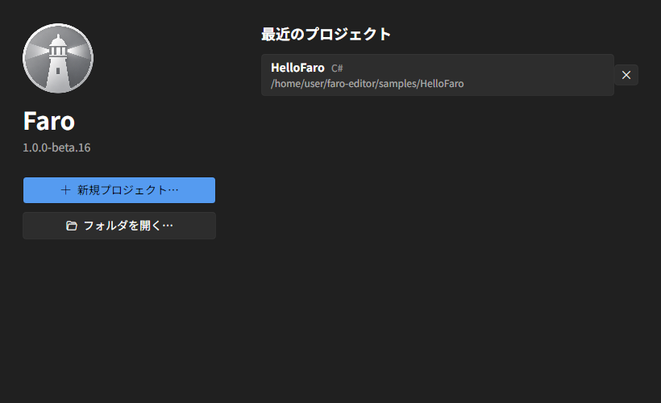

- **New Project…**: pick a template and a language
  - Template: `Sample` (a demo with screens, components and bindings) or `Empty`. **Sample** is the best place to start
  - Language: `C# (Avalonia)` or `Java (JavaFX)`
- **Open Folder…**: open an existing project (a folder that isn't a Faro project is set up after you confirm)
- **Recent**: click to open

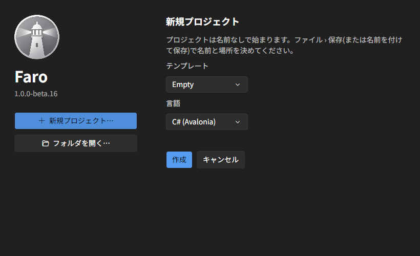

A new project starts **untitled**. When you want to keep it, File › Save (Ctrl+S) asks for a name and a location (by default `Documents/Faro`).

### Trusting a project

The first time you open a folder, Faro asks whether to **Trust** it or open it in **Restricted Mode**. A trusted project can build and run its code, use the language server and the previews. Open projects from people you don't know in Restricted Mode until you've looked at them (switch later with File › Trust Project…).

---

## 3. The main window

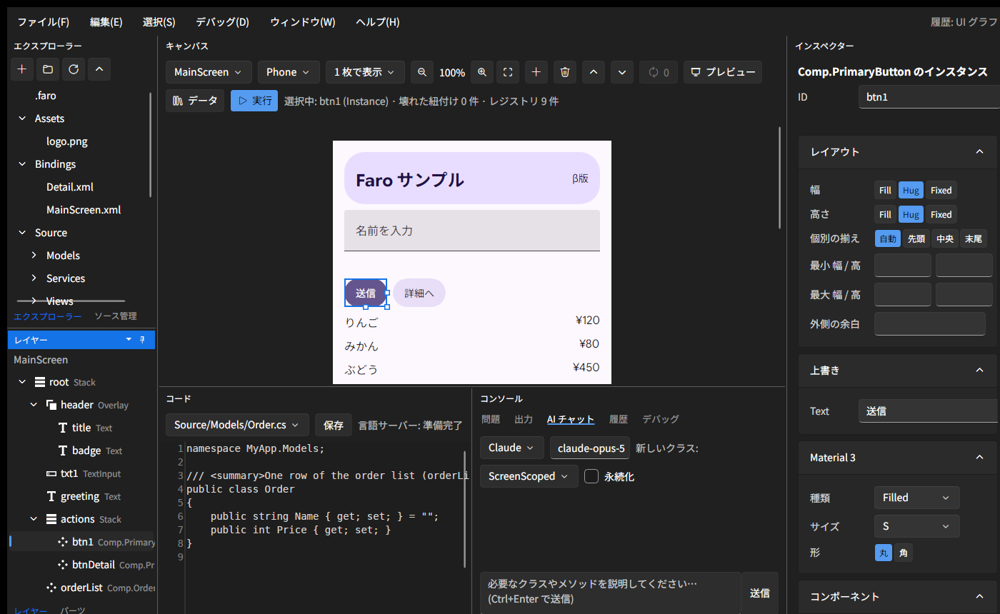

| Where | What it's for |
|---|---|
| Top left: **Explorer** / **Source Control** | The project's files / Git changes and commits |
| Bottom left: **Layers** / **Parts** | The screen's tree of nodes / the parts you can add |
| Center top: **Canvas** | Where you draw the screen. Click to select a node, drag to reorder |
| Right: **Inspector** | Size, layout, look and bindings of the selected node |
| Center bottom: **Code** | The C# / Java code editor (completion and errors) |
| Center bottom: **Console** | Tabs: Problems, Output, AI Chat, History, Debug |

Bring any panel to the front from the Window menu. If the layout gets messy: Window › Reset Layout.

**When in doubt, press Ctrl+Shift+P** (Command Palette) to find any menu command by name.

---

## 4. Building a screen

### Adding nodes

Drag a part from the **Parts** tab onto the canvas, or click it to add it inside the selected node.

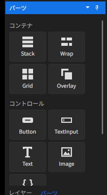

- **Containers**: `Stack` (in a row or a column), `Wrap` (wrapping), `Grid` (rows and columns), `Overlay` (layered, pinned to a corner or the center)
- **Controls**: `Button`, `TextInput`, `Text`, `Image`, `Script` (a part whose look and behavior are built in code)

Faro has **no absolute positions**. Where a node goes is decided by which container it's in, its order, and the settings below.

### Size and arrangement (Inspector › Layout)

- **Width / height**: `Fill` (take the space) / `Hug` (fit the content) / `Fixed` (a number)
- **Min / max**, the outer **margin**, and a container's **gap** and inner **padding**
- **Align**, **Justify** (`SpaceBetween` spreads the children to both ends) and **Align self** (move just this node)
- Spacing can be written as `8` (all sides), `8 16` (vertical horizontal) or `8 16 8 16` (top right bottom left)

### Tokens (shared numbers)

Write tokens like `space.m = 16` under Tokens in File › Project Design…, then type `$space.m` into any spacing or size field. Change the token once and every screen follows.

### Design language

In the same dialog, choose `Fluent` or `Material 3`, a seed color, and light or dark. With Material 3, the inspector's Material 3 section offers per-node options such as the button style (Filled / Tonal / Outlined…).

### Editing basics

- Undo / redo: Ctrl+Z / Ctrl+Y (UI edits if you last touched the canvas, code edits if you last touched the code)
- Copy, paste, duplicate: Ctrl+C / Ctrl+V / Ctrl+D (bindings are duplicated too)
- Delete: Delete; reorder: Alt+↑ / Alt+↓; right-click for more, such as Wrap in a container
- The Console's **History** tab lists your UI edits: click one to go back to it

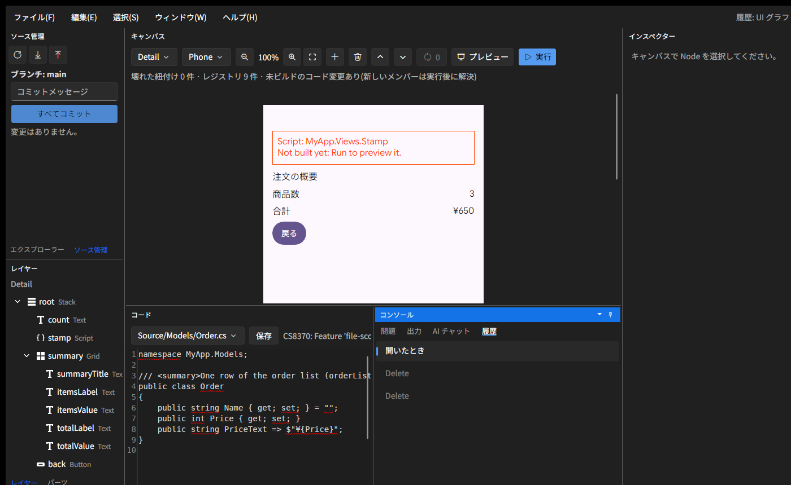

---

## 5. Components (reusable parts)

Make anything you use more than once (a button, a list row) a **component**. In the Explorer, right-click the `UI` folder › New Component…, then edit its master on the canvas. Your components appear under Components in Parts, ready to place on a screen.

- Editing the **master** marks the places that use it (**instances**) as waiting to sync. Apply the change with the sync button (🔄) on the canvas; nothing changes behind your back
- Each instance can **override** texts and other values (Inspector › Overrides)
- **Variants**: select an instance and use Component › New variant… to make another version of the same part (for example, Outlined). The instance's Variant picks which version it uses
- **Repeatable (list)**: turn it on for an instance to make it one row of a list. You can also write mock rows for the canvas

---

## 6. Connecting to code (bindings)

Faro doesn't generate code from your screens. You bind the screen's parts to **members of your classes**, and the Faro runtime connects them when the app runs.

### Write a class

Put your classes in `Source/`. Write them yourself, or ask the Console's **AI Chat**, for example "Create an OrderService with a Submit method that adds an order" (generated code isn't saved until you approve it).

- C#: inherit from `FaroObject` so changes to values reach the screen
- Java: inherit from `FaroObject` and call `changed("PropertyName")` after a change
- An attribute decides how long an object lives (by default `ScreenScoped`, one per screen; one for the whole app is `[FaroLifetime(Lifetime.Singleton)]`; add `Persistent = true` to save it)

### Add a binding

Select a node and add a binding under **Bindings** at the bottom of the inspector.

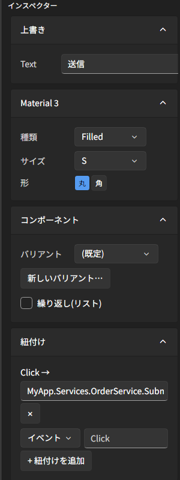

- **Events** (`Click`, `Changed`): call a method when it happens. `Navigate:Screen.Detail` moves to another screen
- **Properties** (`Text`, `Visible`, `Enabled`…): show a value (`OneWay`) or also write input back (`TwoWay`)
- **Format**: add a display format like `¥{0:N0}` (`{0:N0}` thousands separators, `{0:F2}` two decimals)
- **Lists**: bind `Items` on a repeatable instance and it shows one row per item. Nodes inside the row bind to the row's item (for example `Order.Name`)
- **Selecting a row**: bind the row container's `Click` to a method with one parameter (`Open(Order order)`) and it gets the clicked row's item
- **Passing a value to a screen**: call `FaroApp.Navigate("Detail", order)` in code. The target screen's bindings use that value

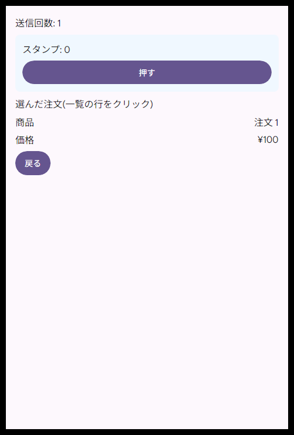

If a name is wrong, or a rename in the code breaks a binding, the node gets a **red badge** and the problem is listed in the Problems tab. The inspector suggests close names: click one to fix it. In C#, renaming a member in Faro's code editor and saving updates the bindings for you.

---

## 7. Checking your work

### On the canvas

- **Preview**: try the buttons and inputs for real (navigation works; your code doesn't run)
- **Data** (C#): shows the canvas with the real values the bindings get from the last build

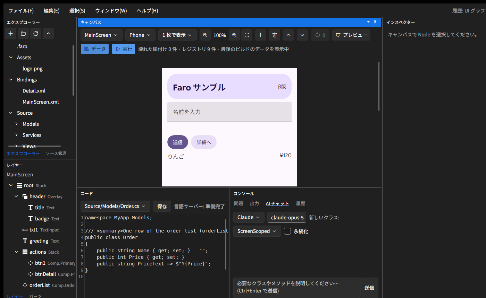

- **Compare**: from One artboard ▾, choose All sizes (Phone / Tablet / Desktop) or Light and dark

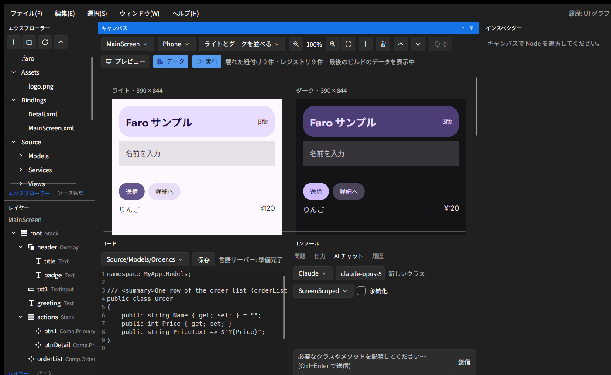

### Run

**Run** (F5) on the canvas starts the app in its own window. Output and build errors go to the Console. In C#, code changes apply while the app runs (hot reload) and UI changes restart it. Java builds with Maven and starts (run again to see changes).

### Debug

Click left of a line number in the code (F9) to set a breakpoint (a red dot), then **Start Debugging** (F6). When it stops, the line turns yellow and the Console's Debug tab shows the call stack and the variables. Continue F8, Step Over F10, Step Into Shift+F10, Stop Shift+F6.

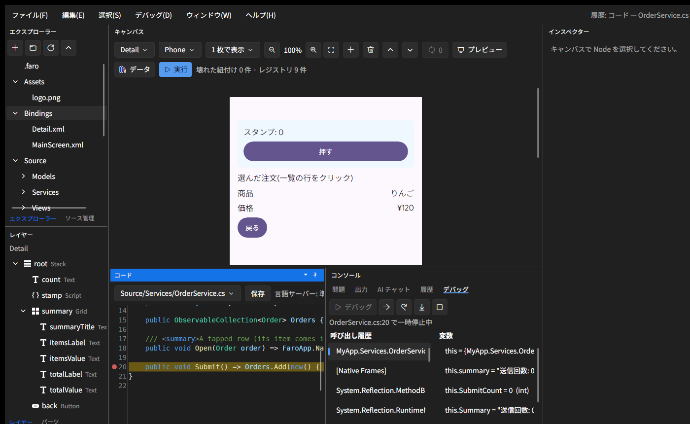

The debugger (netcoredbg for C#, java-debug for Java) is downloaded automatically the first time you use it.

---

## 8. Saving and sharing

- **Git**: the Source Control tab (top left) shows your changes (click one for its diff) and can commit, pull and push

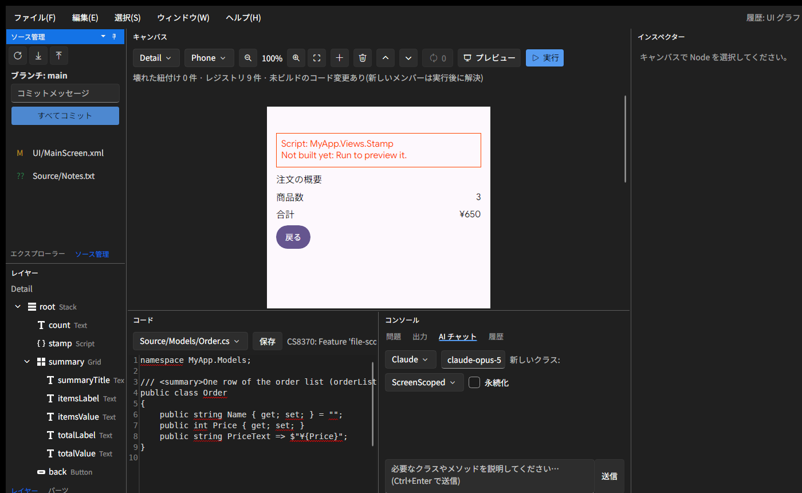

- **Android**: File › Build Android APK puts an APK in `dist/` (the first time, it fetches the Android tools, which takes a while; Java is Linux only)
- A project is a plain folder: `UI/` (screens), `Bindings/` (bindings), `Source/` (code), `Assets/` (images), `faro.json` (settings)

---

## 9. Troubleshooting

| Problem | Where to look |
|---|---|
| A red badge | The Problems tab. Pick a suggestion in the inspector |
| The app won't run | The Output tab. C# needs the .NET 10 SDK; Java needs JDK 21 and Maven (Preferences › Tools) |
| No completion | The language server status above the code. Java takes a while to load the first time |
| Changes don't show | If it says "Unbuilt code changes", Run (F5) applies them |
| Crashes or odd behavior | Help › Open Logs Folder. After a crash, a report window opens right away (Details shows the error) |

---

## Keyboard shortcuts

| Action | Keys |
|---|---|
| Command Palette | Ctrl+Shift+P |
| Open Folder / Save / Save As | Ctrl+O / Ctrl+S / Ctrl+Shift+S |
| Undo / Redo | Ctrl+Z / Ctrl+Y |
| Cut / Copy / Paste / Duplicate / Delete | Ctrl+X / Ctrl+C / Ctrl+V / Ctrl+D / Delete |
| Move a node up / down | Alt+↑ / Alt+↓ |
| Deselect | Ctrl+Shift+A |
| Run / Stop | F5 / Shift+F5 |
| Start / Stop Debugging | F6 / Shift+F6 |
| Breakpoint / Continue / Step Over / Step Into | F9 / F8 / F10 / Shift+F10 |
| Completion | Ctrl+Space (or `.`) |
| Preferences | Ctrl+, |
| Full screen | F11 |
